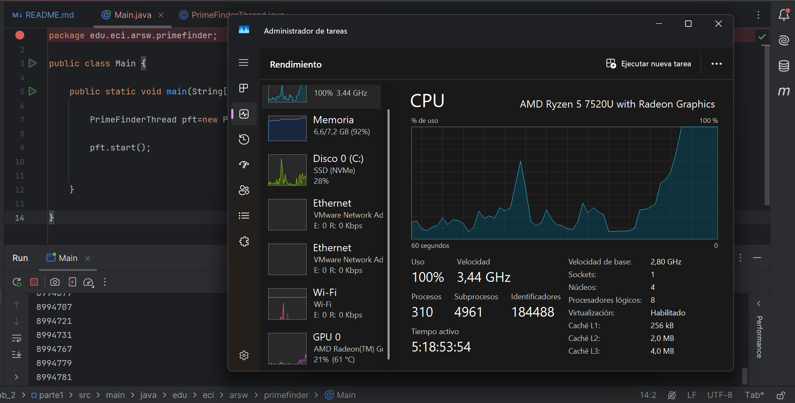

# **Concurrent Programming Workshop – Race Conditions and Thread Synchronization**

## **Description**

This repository contains the solutions and implementations for the Concurrency Workshop, developed as part of the Software Architecture (ARSW) course at Escuela Colombiana de Ingeniería. The workshop explores key concepts of multithreading, race conditions, and synchronization mechanisms in Java.

## **Authors**

- **Santiago Hurtado Martínez** [SantiagoHM20](https://github.com/SantiagoHM20)

- **Mayerlly Suárez Correa** [mayerllyyo](https://github.com/mayerllyyo)

### **Part I - Prime Numbers with Threads**
1. Initially, the program calculates prime numbers between 0 and 30,000,000 using a single thread.

   Observed CPU Metrics:
   - **CPU Utilization:** 100%
   - **Speed:** 3.44 GHz
   - **Active Cores:** ~1 of 4 available
   - **Threads:** 4961

   

   Single Thread Execution Time
   
   
2. It is then modified to use three concurrent threads, each handling a portion of the range, allowing better 
CPU utilization.

   Observed CPU Metrics:
   - **CPU Usage:** 100%
   - **Speed:** 3.45 GHz (turbo boost enabled)
   - **Active Cores:** ~3 of 4 available
   - **Threads:** 5076
   
   
   Runtime with Three Threads
   
   The implementation with three concurrent threads demonstrates the significant advantages of parallel programming on 
multi-core processors, increasing CPU utilization from 84% to 100% and activating turbo boost , indicating better 
utilization of the available hardware. Although the resource consumption is higher, this results in a theoretical 
reduction in execution time to approximately one-third of the original time, since the work is efficiently 
distributed among three processor cores.

3. A pause/resume mechanism is added: after 5 seconds of execution, all threads are stopped and the number of 
primes found is displayed. Execution resumes once the user presses ENTER.

   Implemented Functionality:

   - Automatic Pause: After 5 seconds, all threads pause simultaneously.
   - Progress Report: The total number of primes found during the pause is displayed.
   - User Control: The program waits for user input (ENTER) to continue.
   - Resume: All threads resume execution from where they stopped.

   Example Output
   
### **Part II - Greyhound Race Simulation**