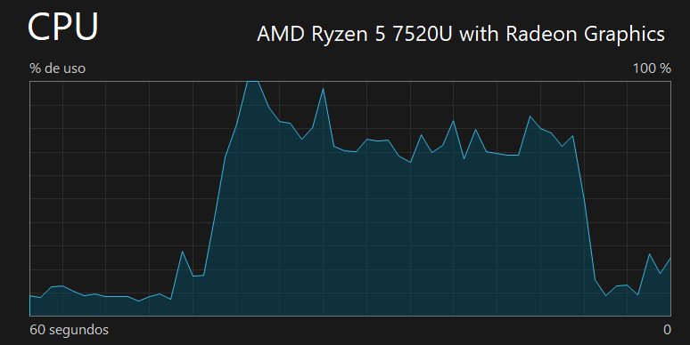

# **Concurrent Programming Workshop – Race Conditions and Thread Synchronization**

## **Description**

This repository contains the solutions and implementations for the Concurrency Workshop, developed as part of the Software Architecture (ARSW) course at Escuela Colombiana de Ingeniería. The workshop explores key concepts of multithreading, race conditions, and synchronization mechanisms in Java.

## **Authors**

- **Santiago Hurtado Martínez** [SantiagoHM20](https://github.com/SantiagoHM20)

- **Mayerlly Suárez Correa** [mayerllyyo](https://github.com/mayerllyyo)

### **Part I - Prime Numbers with Threads**
1. Initially, the program calculates prime numbers between 0 and 30,000,000 using a single thread.

   Observed CPU Metrics:
   - **CPU Utilization:** 100%
   - **Speed:** 3.44 GHz
   - **Active Cores:** ~1 of 4 available
   - **Threads:** 4961

   

   Single Thread Execution Time
   
   
2. It is then modified to use three concurrent threads, each handling a portion of the range, allowing better 
CPU utilization.

   Observed CPU Metrics:
   - **CPU Usage:** 100%
   - **Speed:** 3.45 GHz (turbo boost enabled)
   - **Active Cores:** ~3 of 4 available
   - **Threads:** 5076
   
   
   Runtime with Three Threads
   
   The implementation with three concurrent threads demonstrates the significant advantages of parallel programming on 
multi-core processors, increasing CPU utilization from 84% to 100% and activating turbo boost , indicating better 
utilization of the available hardware. Although the resource consumption is higher, this results in a theoretical 
reduction in execution time to approximately one-third of the original time, since the work is efficiently 
distributed among three processor cores.

3. A pause/resume mechanism is added: after 5 seconds of execution, all threads are stopped and the number of 
primes found is displayed. Execution resumes once the user presses ENTER.

   Implemented Functionality:

   - Automatic Pause: After 5 seconds, all threads pause simultaneously.
   - Progress Report: The total number of primes found during the pause is displayed.
   - User Control: The program waits for user input (ENTER) to continue.
   - Resume: All threads resume execution from where they stopped.

   Example Output
   
### **Part II - Greyhound Race Simulation**

For this exercise you will work with a greyhound racing simulator (folder part2), whose graphic representation corresponds to the following figure:

In the simulation, all greyhounds have the same speed (at the programming level), so the winning greyhound will be the one (due to chance) that has benefited the most from the processor scheduling (i.e., the one that has been allocated the most CPU cycles during the race). The application model is as follows:

As you can see, the greyhounds are threaded objects, and their progress is displayed in the Canodromo class, which is basically a Swing form. All the greyhounds (by default, there are 17 greyhounds running on a 100-meter track) share access to a FinishRecord object. When a greyhound reaches the finish line, it accesses the counter located in that object (which initially has a value of 1), takes that value as its finish position, and then increments it by 1. The greyhound that manages to reach the "1" position will be the winner.

When starting the application, there is an obvious error: the results (total distance and number of the winning greyhound) are displayed before the race itself has finished. However, once this is corrected, it is possible that further inconsistencies will arise due to race conditions.

1.Correct the application so that the results notification is displayed only when all the greyhound threads have completed execution. To do this, keep in mind:

a. The action of starting the race and displaying the results begins on line 38 of MainCanodromo.

b. The join() method of the Thread class can be used to synchronize the thread that starts the race with the completion of the greyhound threads.

´´´java

@Override
    public void actionPerformed(final ActionEvent e) {
        ((JButton) e.getSource()).setEnabled(false);
        new Thread() {
            public void run() {
                for (int i = 0; i < can.getNumCarriles(); i++) {
                    galgos[i] = new Galgo(can.getCarril(i), "" + i, reg);
                    galgos[i].start();
                }

                for (int i = 0; i < can.getNumCarriles(); i++) {
                    try {
                        galgos[i].join();
                    } catch (InterruptedException ex) {
                        ex.printStackTrace();
                    }
                }

                can.winnerDialog(reg.getGanador(),
                        reg.getUltimaPosicionAlcanzada() - 1);
                System.out.println("El ganador fue: " + reg.getGanador());
            }
        }.start();
    }
});
´´´

2.Once the initial problem has been corrected, run the application several times and identify inconsistencies in the results by viewing the ranking displayed in the console (sometimes valid results may be output, but in other cases, these inconsistencies may occur). From this, identify the critical regions () of the program.

Output expample:

      El galgo 8 llegó en la posición 5

      El galgo 16 llegó en la posición 4

      El galgo 6 llegó en la posición 3

      El galgo 12 llegó en la posición 1

      El galgo 0 llegó en la posición 2

      El galgo 14 llegó en la posición 6

      El galgo 3 llegó en la posición 7

      El galgo 5 llegó en la posición 7 

      El galgo 1 llegó en la posición 10

      El galgo 9 llegó en la posición 10

      El galgo 15 llegó en la posición 12

      El galgo 2 llegó en la posición 14

      El galgo 10 llegó en la posición 12 

      El galgo 4 llegó en la posición 11

      El galgo 11 llegó en la posición 16

      El galgo 13 llegó en la posición 15

      El galgo 7 llegó en la posición 5 

Here we detect inconsistency between the greyhounds because there are repeated positions

In adition We detected critical regions in the "corra()" method of the Galgo class.

´´´java

public void corra() throws InterruptedException {
		while (paso < carril.size()) {			
			Thread.sleep(100);
			carril.setPasoOn(paso++);
			carril.displayPasos(paso);
			
			if (paso == carril.size()) {						
				carril.finish();
				int ubicacion=regl.getUltimaPosicionAlcanzada();
				regl.setUltimaPosicionAlcanzada(ubicacion+1);
				System.out.println("El galgo "+this.getName()+" llego en la posicion "+ubicacion);
				if (ubicacion==1){
					regl.setGanador(this.getName());
				}
				
			}
		}
	}
´´´

However there are some critic regions in the action methods in "MainCanodromo" class
There is no logic or synchronization to the actions

´´´java
can.setStopAction(
                new ActionListener() {
                    @Override
                    public void actionPerformed(ActionEvent e) {
                        System.out.println("Carrera pausada!");
                    }
                }
        );

        can.setContinueAction(
                new ActionListener() {
                    @Override
                    public void actionPerformed(ActionEvent e) {
                        System.out.println("Carrera reanudada!");
                    }
                }
        );
´´´

And above all, a method is missing in the "RegistroLlegada" class that performs the logic of the final position, granting the first greyhound position 1 and increasing it.

3.Use a synchronization mechanism to ensure that only one thread accesses these critical regions at a time. Verify the results.

4.Implement the pause and resume functionality. With these, when 'Stop' is clicked, all greyhound threads should go to sleep, and when 'Continue' is clicked, they should wake up and continue the race. Design a solution that allows this to be done using the synchronization mechanisms with the Lock primitives provided by the language (wait and notifyAll).
